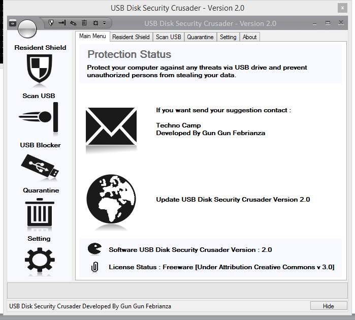

# USB-Disk-Security
USB Security Software. Call the Knight to fight Malware Spread.

USB Disk Security Crusader Version 2.0 
Bongkar lagi software-software keamanan lama yang telah saya buat, karena saya sudah tidak terlalu aktif lagi disini saya memutuskan untuk membuka dan membagikanya.

Ini bisa bermanfaat untuk mencegah infeksi virus ransomeware, bisa juga digunakan sebagai referensi untuk rekan-rekan dan adik adik kelas yang mau skripsi tentang keamanan tahun depan. 

Ada 8 desain algoritma untuk keamanan menarik yang sudah saya buat, kalau senang dan penasaran bisa dipelajari ^_^ :

<ul>
<li>USB Detector Algorithm</li>
<li>Detect USB Letter Algorithm</li>
<li>Kill Autorun Algorithm</li>
<li>Detect Autorun Algorithm</li>
<li>Execute Shell Algorithm</li>
<li>Autorun Reader Algorithm</li>
<li>GGF Quarantine Algorithm</li>
<li>Autorun Defender Algorithm</li>
</ul>

USB Disk Security Crusader adalah perangkat lunak yang memiliki multifitur yang canggih diantaranya adalah mampu untuk mencegah penyebaran malware virus ke dalam sistem operasi kita dari USB yang telah terkontaminasi atau terinfeksi malware virus. 

Bagaimana sih mekanismenya ketika sistem operasi kita terinfeksi virus dari USB?

Sistematika sistem operasi kita bisa terinfeksi oleh malware virus karena file autorun.inf berhasil mengeksekusi malware virus pada saat mode autoplay ketika USB pertama kali dimasukan kedalam komputer. 

Sehingga untuk mencegah malware virus melakukan infeksi sistem operasi, kita harus mengkebiri atau menghapus file autorun.inf sebelum aurotun mengeksekusi malware virus. 

Untuk mengimplementasikan fitur ini diciptakanlah sebuah algoritma USB Detector Algorithm yaitu sebuah algoritma yang memanfaatkan windows message code yang khusus digunakan untuk mendapatkan pesan jika terjadi perubahan pada device sehingga ketika ada USB yang dimasukan atau dicabut pada komputer bisa diketahui. 

Pada saat terjadi trigger pendeteksian ketika USB dimasukan kedalam komputer maka 5 algoritma lainya juga akan tereksekusi secara sistematis pertama sebuah algoritma khusus untuk mendeteksi drive letter atau alamat drive akan dieksekusi. Algoritma tersebut adalah Detect USB Letter Algorithm. 

Setelah diketahui alamat drive letter dari USB maka algoritma selanjutnya akan dieksekusi, yaitu algoritma Kill Autorun Algorithm. Di dalam algoritma Kill Autorun Algorithm terdapat sebuah sub algoritma khusus yaitu Detect Autorun Algorithm.
 
Algoritma Detect Autorun Algorithm berfungsi untuk merubah tiga attribute file autorun.inf menjadi unread-only file, unsystem file dan unhidden file attribute. Proses pengubahan attribute ini digunakan agar autorun.inf bisa dihapus dengan mudah karena autorun.inf yang memiliki attribut (+r +s +h)  atau read-only file, system file dan hidden file attribute tidak akan bisa deteksi oleh algoritma Kill Autorun Algorithm. 

Maka dari itu algoritma Detect Autorun Algorithm harus membuat attribute file autorun.inf menjadi (-r -s -h) semua itu hanya bisa dilakukan menggunakan perintah DOS. Untuk menggunakan perintah DOS yaitu command attrib, Detect Autorun Algorithm akan memanfaatkan sebuah method dari algoritma Execute Shell Algorithm yaitu method Execute Command Sync. 

Execute Shell Algorithm adalah sebuah algoritma khusus untuk mengeksekusi perintah shell menggunakan cmd.exe beserta parameternya tanpa menampilkan layar hitam dari cmd.exe. Setelah perintah DOS dieksekusi maka autorun.inf akan nampak, setelah menampak sebuah algoritma khusus untuk membaca script command dari autorun.inf akan dieksekusi, algoritma tersebut adalah Autorun Reader Algorithm. 

Sehingga user bisa mengetahui perintah-perintah apa saja yang ada didalam autorun.inf. Analoginya seperti seorang penyusup yang telah tertangkap sehingga kita bisa mengetahui siapa orang-orang yang ada dibelakang dan dibalik penyusupan ini. #eaaa 

Setelah itu algoritma terakhir akan dieksekusi yaitu GGF Quarantine Algorithm (Narsis dikit bole ya?), sebuah algoritma khusus untuk mengkarantina autorun.inf sehingga autorun.inf akan gagal untuk mengeksekusi malware virus dengan begitu sistem operasi kita akan selamat dari infeksi malware virus. 

Selain itu terdapat fitur USB Scan, fitur ini digunakan untuk melakukan pelacakan malware virus yang terdapat pada USB. Metode scanning menggunakan algoritma Scan By Patterns Algorithm, sebuah algoritma yang dapat mengumpulkan beberapa list files dalam USB berdasarkan extension patterns. 

Untuk membasmi malware virus yang menjadi suspect threat menggunakan algoritma GGF Kill Virus Algorithm, sebuah algoritma yang memiliki kemampuan untuk menghapus malware virus dan untuk membersihkan malware virus dengan cara mengkarantinya menggunakan algoritma GGF Quarantine Virus Algorithm. 

Fitur selanjutnya adalah menonaktifkan fungsi autorun atau yang biasa disebut autoplay, sehingga setiap media yang menggunakan layanan autorun tidak akan berfungsi dengan begitu infeksi malware virus melalui media eksternal seperti CD,DVD,USB dan lain-lainya bisa di hentikan. Untuk mengimplementasikanya dengan menciptakan algoritma Autorun Defender Algorithm, sebuah algoritma dimana fungsi autorun atau autoplay bisa dinonaktifkan dan diaktifkan sesuai keinginan user.  

Fitur unggulan sisanya adalah kemampuan perangkat lunak ini untuk menonaktifkan fungsi port USB sehingga setiap USB yang masuk kedalam komputer kita tidak akan berfungsi atau terdeteksi, ini digunakan untuk mencegah orang-orang yang tidak kita inginkan bisa mengambil data dan informasi yang kita miliki. Untuk implementasi fitur ini di ciptakan sebuah algoritma yaitu GGF Port USB Manipulator Algorithm, sebuah algoritma yang memiliki kemampuan untuk menonaktifkan port USB dan juga untuk mengaktikan kembali port USB.

----------------
MIT License
